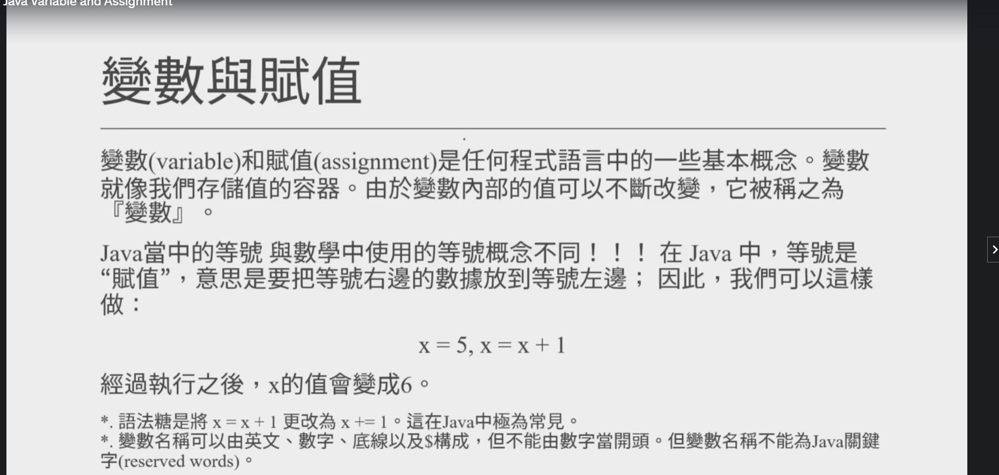
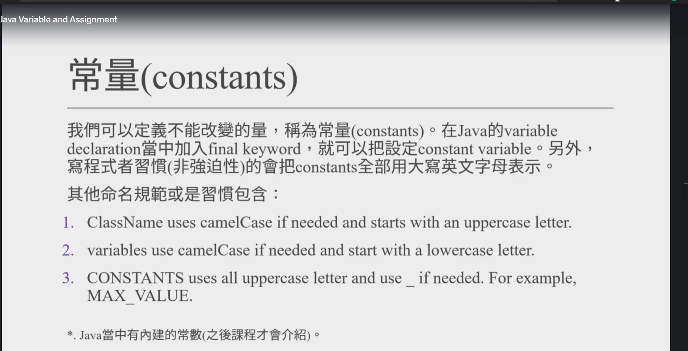

[來杯Java吧! 2022 Java 入門到精通課程](https://www.udemy.com/course/java-master-chinese/)
======

# 1.基本語法

## 1.1 變數與賦值
```java
public class Main {
    public static void main(String[] args) {
        int x =5;
        x=x+1;
        System.out.println(x);
    }
}
```

X += 1 == x=x+1 是一種語法糖

```java
public class Main {
    public static void main(String[] args) {
       int x = 5;
       int y = 6;
        System.out.println(x + y);
    }
}
```

## 1.2 常量 constants


```java
public class Main {
    public static void main(String[] args) {
        final double PI = 3.14; //variable declaration 宣告變數
        PI = 5; //報錯
    }
}
```


