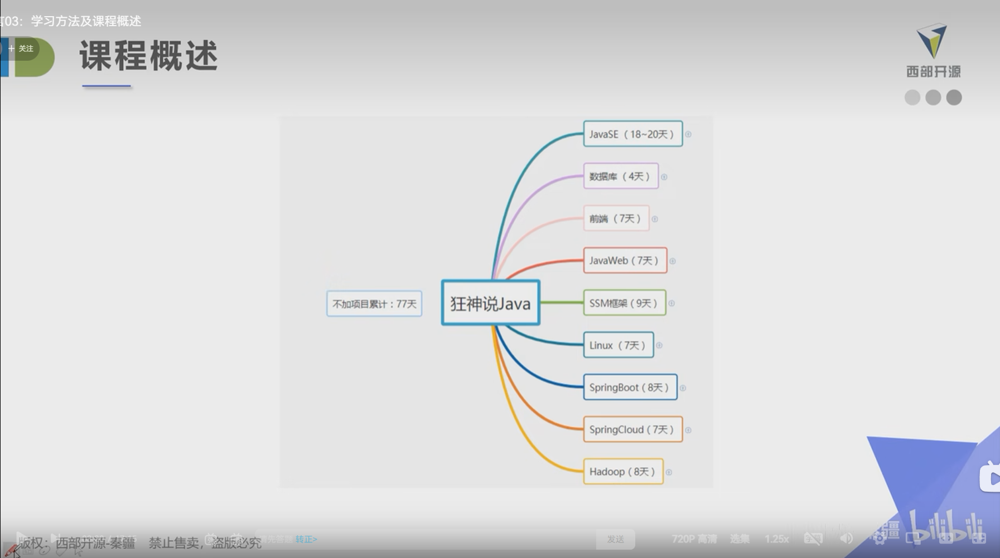
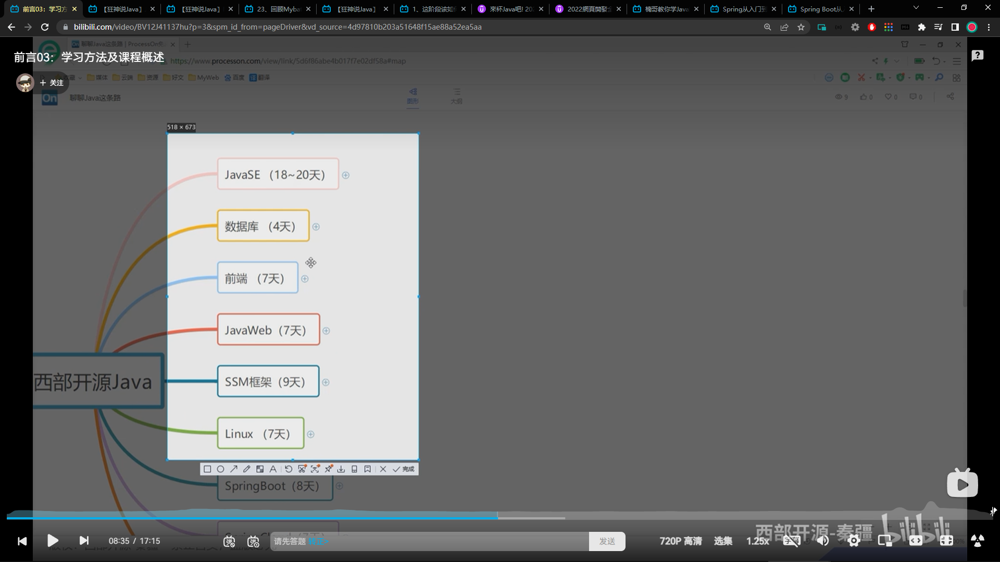
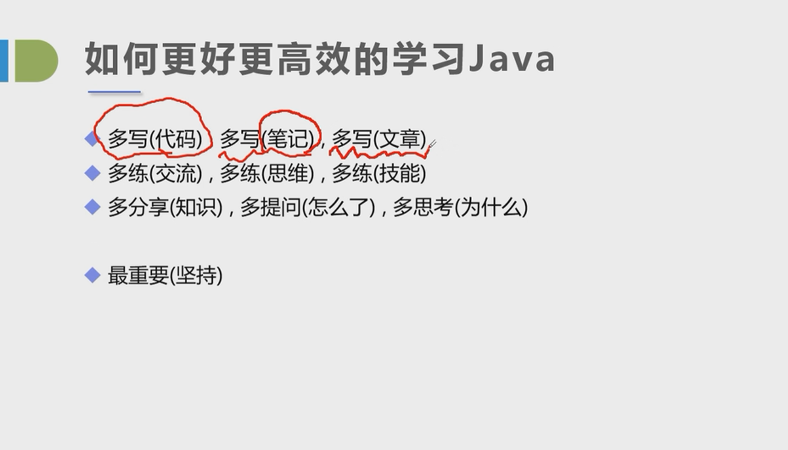
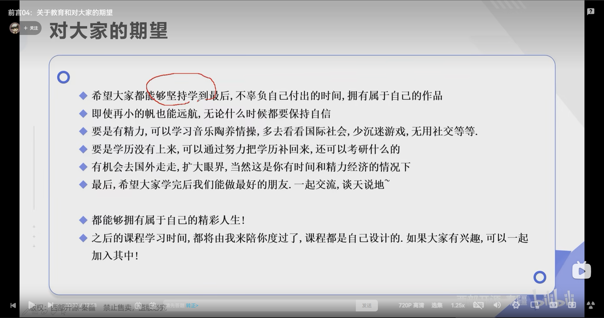
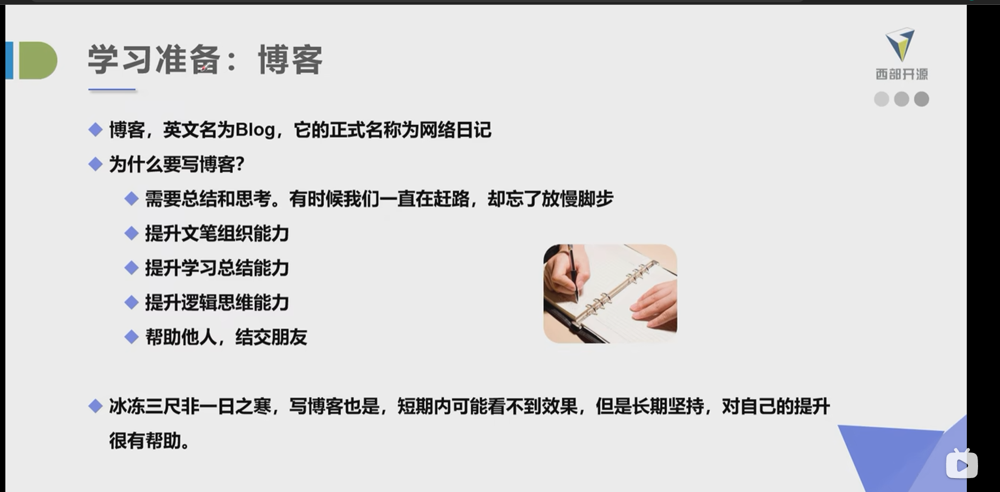
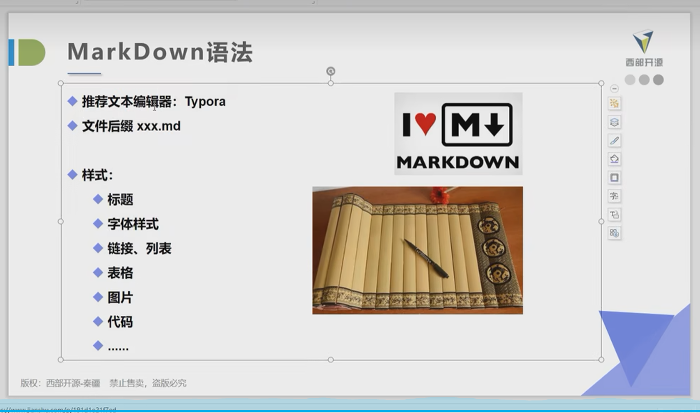
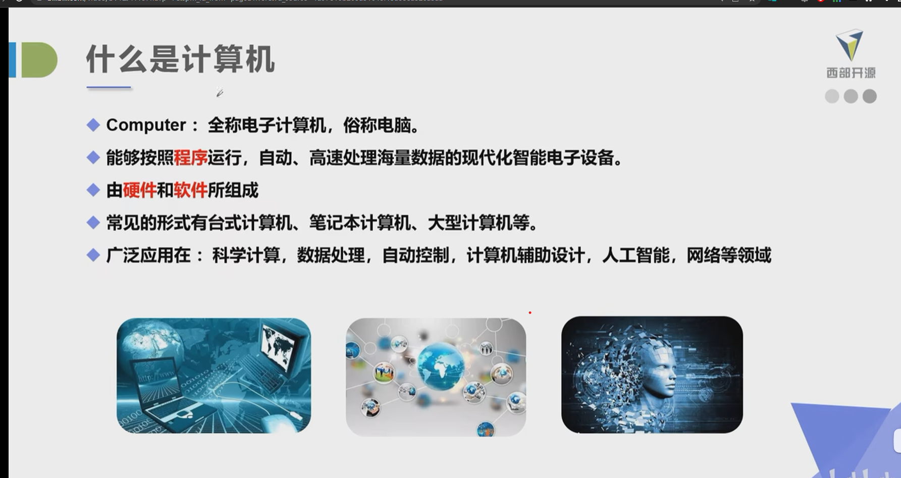

課程概述-學習地圖


第一階段 - 學習目標











名字|性別|生日
--|--|--|
張三|男|1997|



打開cmd的方式
1. 開始+系統
2. Win+R 輸入cmd打開控制台(推薦使用)
3. 在任意的文件夾下面按住shift鍵+鼠標右鍵點擊，在此打開命令行窗口
4. 資源管理器的地址欄前面加上cmd路徑

管理員方式運行:選擇以管理員方式運行

常用的dos命令

```bash
#盤符切換 c:
#查看當前目錄所有檔案 dir


```

