Java帝國的起源
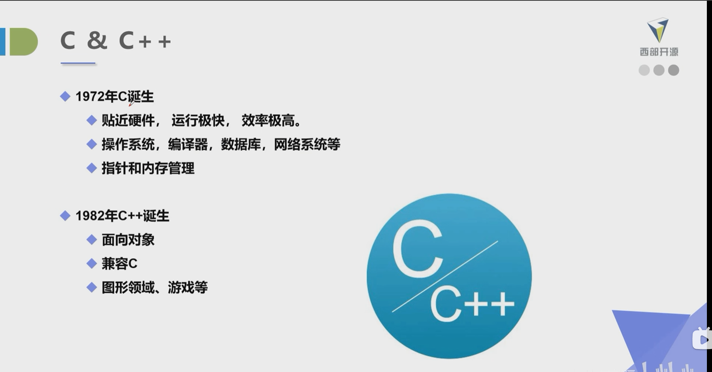

1.安裝JDK

刪除JDK
1. 刪除java的安裝目錄
2. 刪除JAVA_HOME
3. 刪除path下關於java的目錄
4. java -version

安裝JDK
1. 搜尋JDK 8
2. 下載電腦的對應版本
3. 安裝JDK
4. 記住安裝的路徑
5. 配置環境變量
   1. 我的電腦-->右鍵-->屬性
   2. 環境變量-->JAVA_HOME
   3. 配置path變量
6. 測試JDK是否安裝成功
   1. 打開cmd
   2. java -version

安裝notepad++

Java HelloWorld
1. 隨便新增一個資料夾
2. 新建一個java文件
   - 文件附檔名為.java
   - Hello.java
   - 【注意點】系統可能沒有顯示副檔名
3. 編寫代碼

```java
public class Hello{
    public static void main(String[] args){
        System.out.println("Hello World");
    }
}
```
   
4. 編譯 javac java文件，會生成一個class文件
5. 運行class文件，java class文件

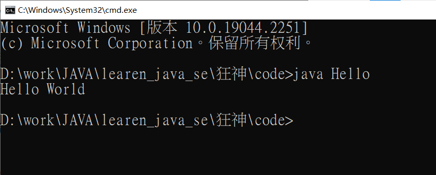

可能遇到的問題
1. 每個單字的大小不能出現問題， **java是大小寫敏感的**
2. 盡量使用英文
3. 文件名與class名必需一樣，並且首字母大寫
4. 符號使用了中文的

Java程序運行機制
- 編譯型
- 解釋型

java是哪一種? 混和型，都有

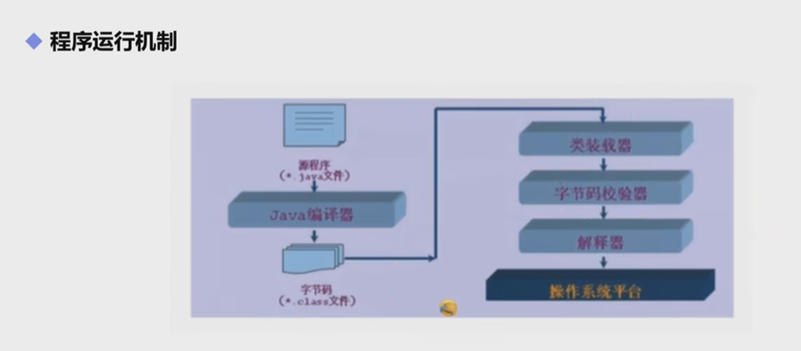


# Java 基礎語法

### 註釋
註釋並不會被執行，是給我們人看的

書寫註釋是一個非常好的習慣
平時寫code一定要注意規範

### 數據類型

### 類型轉換

### 變量、常數

### 運算符

### 包機制，javadoc

# 標示符

關鍵字

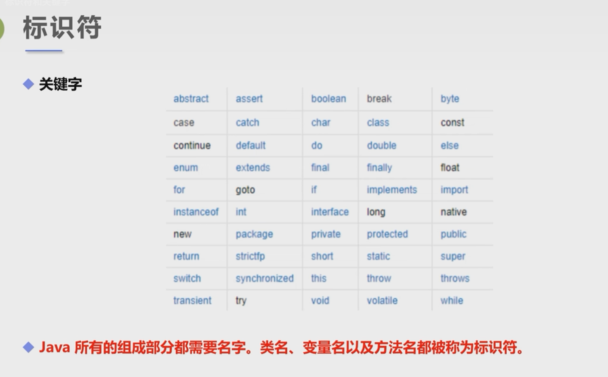

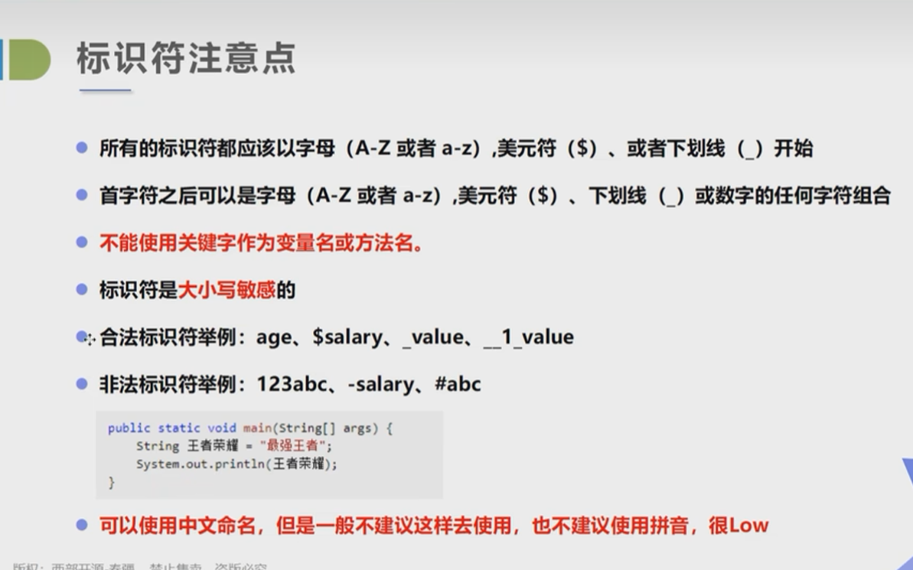

# 數據類型

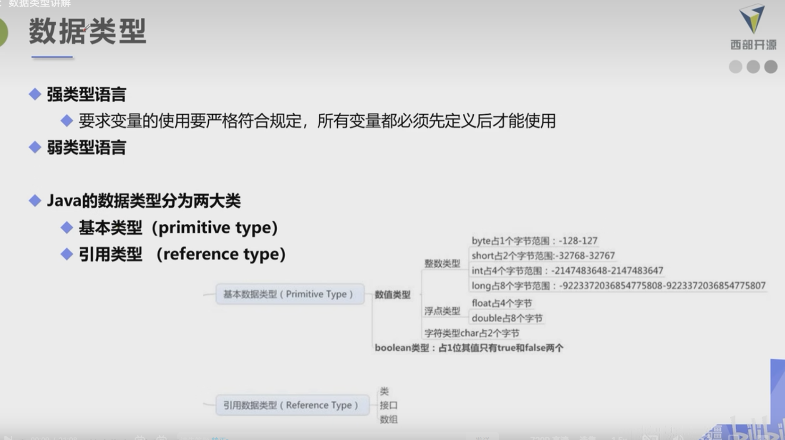

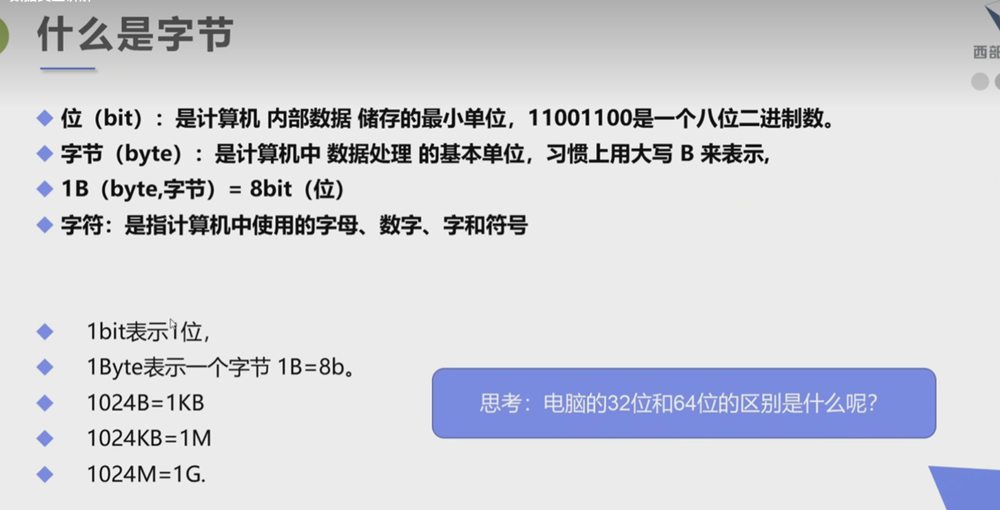


## 變量作用域
+ 類變量
+ 實例變量
+ 局部變量

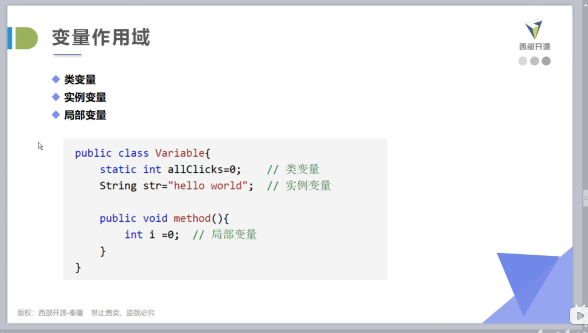

## 常量

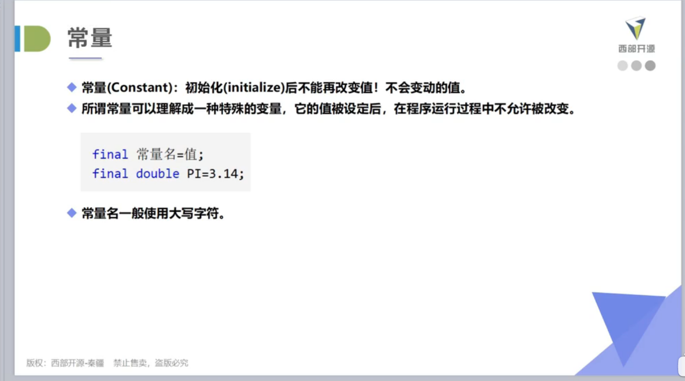

## 變量的命名規範

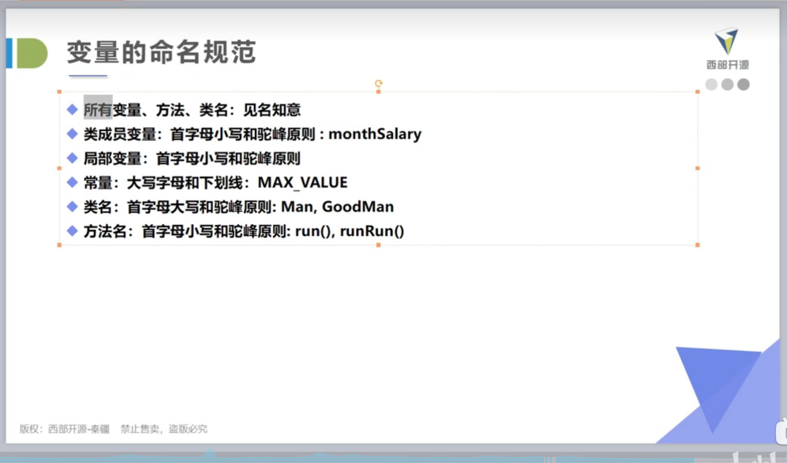

## 常量
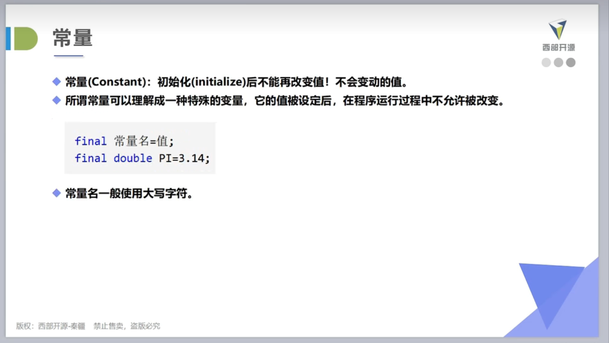

## 運算符

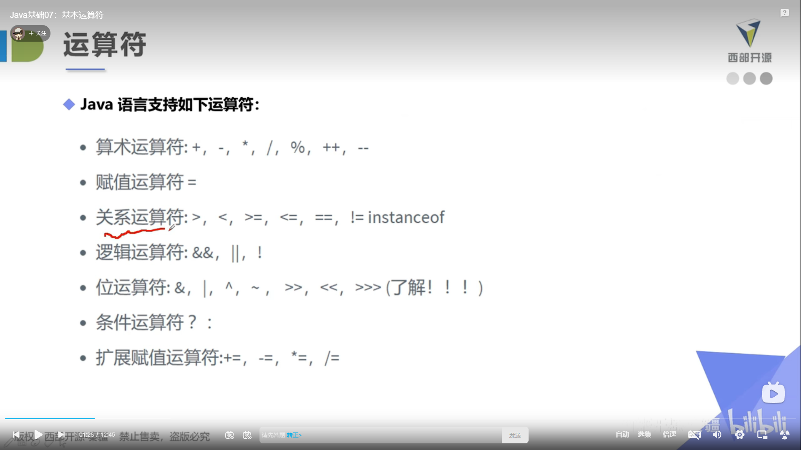

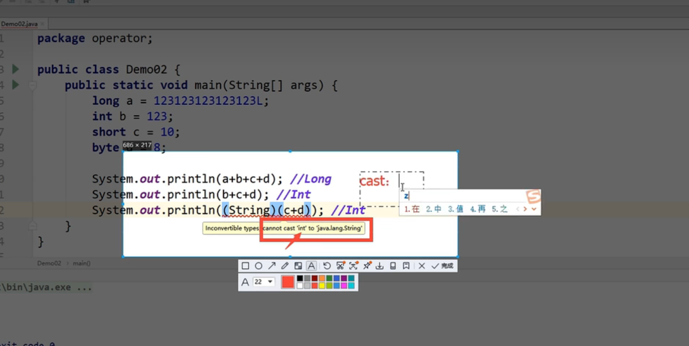

運算符優先級

## 包機制

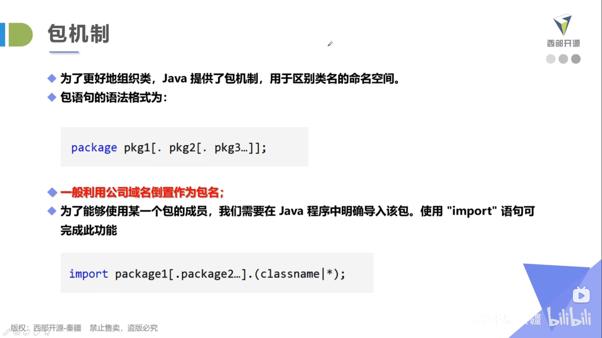

## java doc

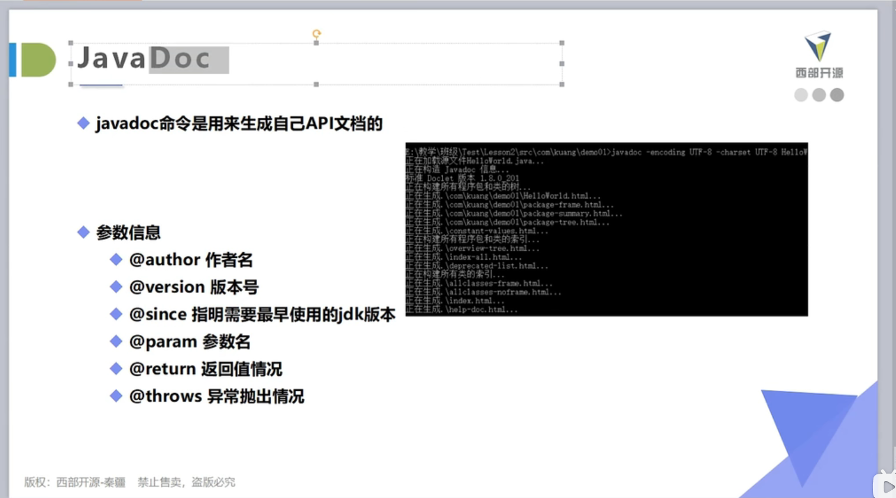

如何使用
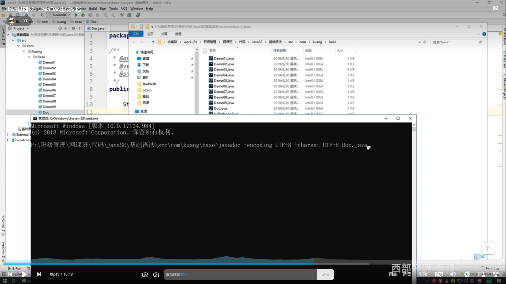

# Java 流程控制

## Scanner對象

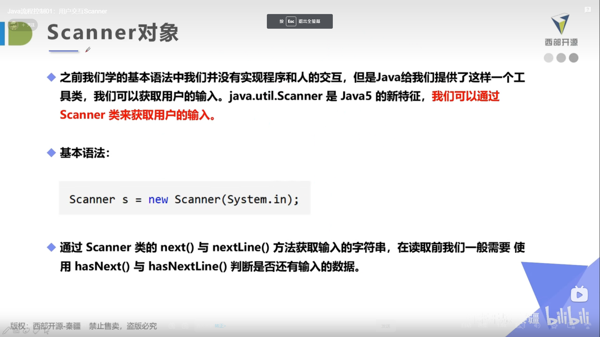

TODO 自己敲


## 順序結構
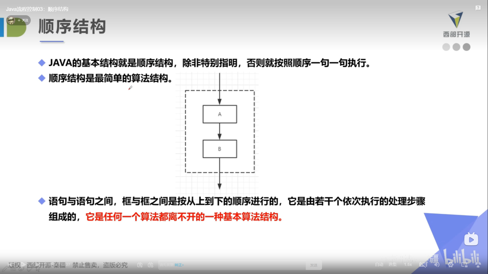


